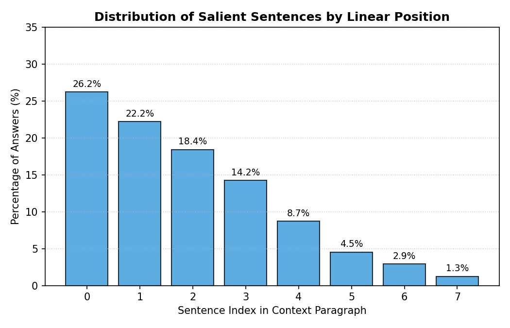
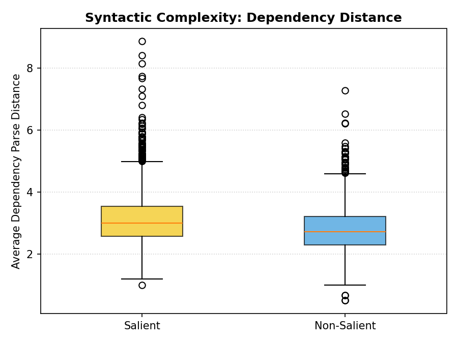
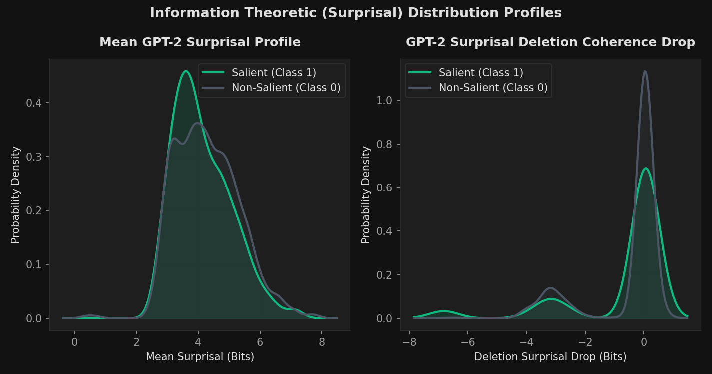
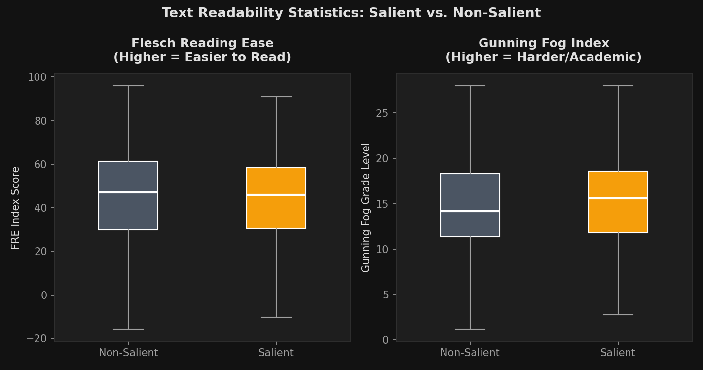
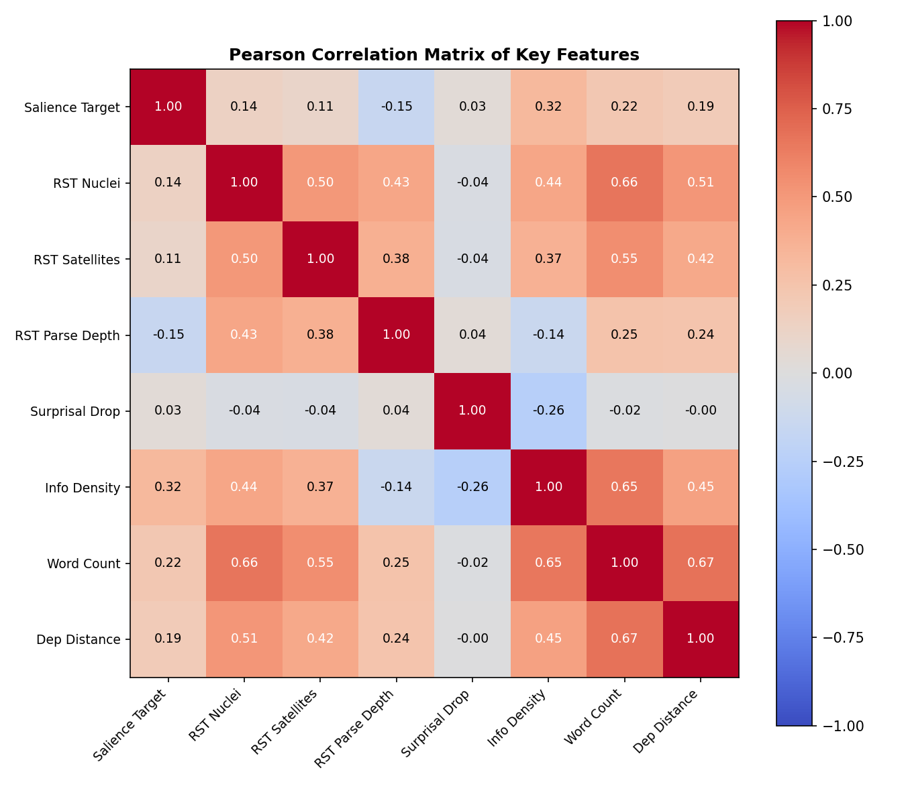

# SQuAD Sentence Salience - Discourse & Semantic Inference System

This repository contains the implementation, features, and comparative models for predicting sentence salience in SQuAD context passages. The system integrates Rhetorical Structure Theory (RST) discourse hierarchies, SBERT semantic alignment, GPT-2 lexical surprisals, and syntactic indicators.

---

## 1. Project Overview

Predicting which sentences in a passage are salient (contain answers to specific questions) is a crucial step in reading comprehension, document summarization, and query-focused retrieval. 

This codebase evaluates **13 model configurations** across **5 dataset balancing techniques**, comparing traditional linear models with hybrid deep learning architectures on SQuAD v1.1.

---

## 2. Documentation Index

Detailed guides detailing each step of the data and modeling process are available:
* **[Data Cleaning & Labeling Guide](data_cleaning_process.md)**: Explains the exact-index silver annotation mapping, LLM-as-a-judge verification results, and recommendations for removing boundary noise.
* **[Data Balancing Guide](data_balancing_process.md)**: Outlines the mathematical formulations of the 5 training balancing methods (None, Pairwise, Cluster, RST-Neighborhood, DSNB).
* **[Classifier Catalog](classifier_catalog.md)**: Describes the architecture and parameters of the 13 rule-based, linear, and hybrid transformer models.
* **[Feature Subsets Guide](feature_subsets_guide.md)**: Directory of all 71 extracted features and their configuration mapping.
* **[LLM Verification Report](llm_judge_verification.md)**: Updated results of the local Qwen-1.5B dataset audit.
* **[Feature Importance Report](feature_importance.md)**: Standardized coefficient analysis of all Logistic Regression classifiers.

---

## 3. Core Experimental Results

Evaluated on SQuAD contexts (2,156 training records and 1,322 validation records) across all 5 dataset balancing techniques. The complete, detailed metrics grid containing Accuracy, Precision, Recall, F1, MRR, MAP, and NDCG for all 13 configurations is available in the dedicated **[Metrics Table (metrics.md)](metrics.md)**.

### Top-Performing Configurations Summary

| Model Configuration | Balancing Method | Accuracy | F1-Score | NDCG |
| :--- | :--- | :---: | :---: | :---: |
| **Heuristic-Guided BERT (RST)** | None | **0.8283** | **0.6771** | **0.9535** |
| **Heuristic-Guided BERT (RST)** | Pairwise | 0.8154 | 0.6563 | 0.9475 |
| **Combined Logistic Regression** | None | 0.7867 | 0.6375 | 0.9496 |
| **Combined Logistic Regression** | DSNB | 0.7224 | 0.5853 | 0.9195 |

*For the full 65-row results grid, please refer to the **[Complete Experimental Results (metrics.md)](metrics.md)**.*

---

## 4. Dataset Statistics & Analysis

Rigorous statistical analysis of our processed SQuAD sentence-level dataset (3,478 records total) highlights several key characteristics:

### A. Dimensions & Splits
* **Total unique contexts**: 75 (60 train, 15 validation)
* **Total QA pairs**: 640 (337 train, 303 validation)
* **Total sentence-question records**: 3,478 (2,156 train, 1,322 validation)
* **Class Imbalance**: Salient sentences (Class 1) comprise **19.41%** (675 records), while Non-salient sentences (Class 0) comprise **80.59%** (2,803 records).

### B. Extreme Positional Bias
Over **66.37%** of all salient sentences reside at Sentence Index 0, 1, or 2 inside their context paragraph. This creates a spatial shortcut that classifiers can easily exploit unless neutralized by balancing methods like **DSNB** (Discourse-Semantic Neighborhood Balancing).



### C. Advanced Statistical Testing (Welch's T-Test)
To establish the validity of our feature set, we conducted Welch's t-tests comparing salient vs. non-salient sentence characteristics:
* **Syntactic Complexity**: Salient sentences have significantly deeper dependency parse trees (mean **6.57** vs. **6.16**, $p < 0.0001$) and larger child-to-head token distances (mean **3.32** vs. **3.06**, $p < 0.0001$), as visualized below:



* **Information Theoretic (Surprisal)**: Removing salient sentences causes a significantly larger surprisal deletion coherence drop (higher surprisal increase) in the paragraph than removing non-salient sentences ($p < 0.05$), proving they carry critical information context.



* **Readability Insignificance**: Readability metrics (Flesch Reading Ease and Gunning Fog index) show no statistically significant difference between salient and non-salient sentences, indicating basic text readability is not a strong salience discriminator.



### D. Feature Co-linearity Heatmap
Pearson correlation matrix of the top features shows that semantic alignment features (SBERT, Jaccard, ROUGE-L) are highly collinear ($r > 0.85$), whereas RST discourse structures and surprisal features are independent ($r < 0.10$), indicating they provide complementary structural contexts.



*For more details, see the complete [SQuAD Silver Data Rigorous Statistical Analysis Guide](docs/silver_data_analysis.md) and [Dataset Audit & Analysis Report](docs/dataset_analysis_report.md).*

---

## 5. Quick Start

### Installation
Set up a python environment (e.g. Conda) and install requirements:
```bash
pip install -r requirements.txt
python -m spacy download en_core_web_sm
```

### Running the Pipeline
Run the full SQuAD feature extraction, model fitting, and evaluation pipeline:
```bash
python run_pipeline.py
```
This script automatically runs all 13 model configurations across all 5 dataset balancing techniques and saves the output to `metrics.csv` and `metrics.md`.
