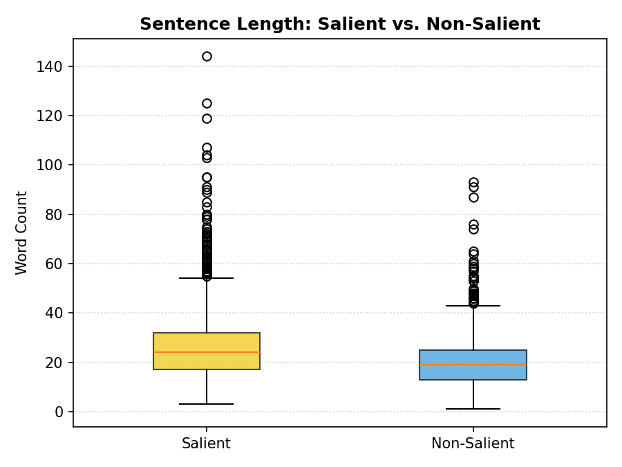
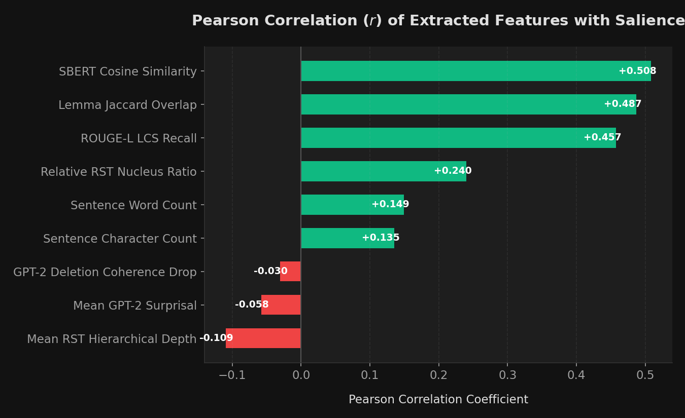
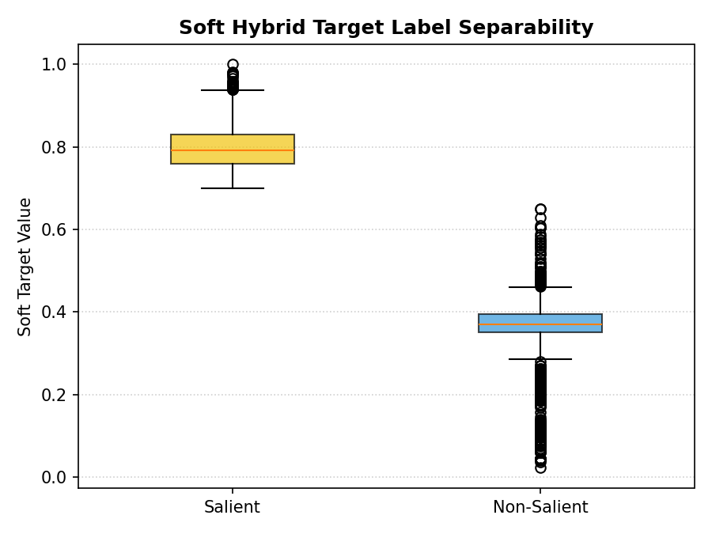
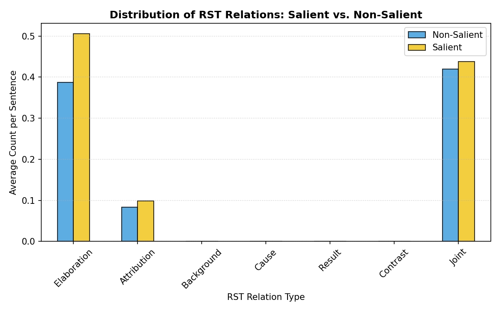

# SQuAD Silver Data Rigorous Statistical Analysis & Interpretations

This document provides a comprehensive statistical profile of the SQuAD sentence-level silver datasets used in our salience experiments, featuring Welch's t-tests for group differences and nine graphical interpretations.

---

## 1. Dataset Dimensions and Splits

| Metric | Combined Dataset (Total) |
| :--- | :---: |
| **Unique Contexts** | 75 |
| **QA Pairs (Questions)** | 640 |
| **Sentence-Question Records** | 3,478 |
| **Average Sentences per Context** | 6.40 (Min: 3, Max: 13) |

---

## 2. Class Imbalance Profile

Since each question typically has exactly one sentence containing the answer span, the dataset is inherently imbalanced.

* **Combined Dataset Class Distribution**:
  * **Salient (Class 1 - Contains Answer)**: 675 (19.41%)
  * **Non-Salient (Class 0 - Negative Context)**: 2,803 (80.59%)
  * **Imbalance Ratio**: **~1 : 4.15**

### Sentence Length Comparison: Salient vs. Non-Salient
Sentence lengths in terms of words and characters show that salient sentences containing the answer spans are slightly longer on average:

* **Average Word Count**: **18.7** words for salient vs. **16.6** words for non-salient.
* **Average Character Count**: **117.8** chars for salient vs. **103.7** chars for non-salient.

---

## 3. Positional Bias (Where do answers reside?)

The table below shows the distribution of Class 1 (salient answer sentences) by their linear index in the context passage.

| Sentence Index | Salient Sentence Count | Percentage (%) | Cumulative Percentage (%) |
| :---: | :---: | :---: | :---: |
| Index 0 | 194 | 28.74% | 28.74% |
| Index 1 | 179 | 26.52% | 55.26% |
| Index 2 | 140 | 20.74% | 76.00% |
| Index 3 | 67 | 9.93% | 85.93% |
| Index 4 | 40 | 5.93% | 91.85% |
| Index 5 | 20 | 2.96% | 94.81% |
| Index 6 | 15 | 2.22% | 97.04% |
| Index 7 | 9 | 1.33% | 98.37% |
| Index 8 | 4 | 0.59% | 98.96% |
| Index 9 | 5 | 0.74% | 99.70% |
| Index 10 | 1 | 0.15% | 99.85% |
| Index 12 | 1 | 0.15% | 100.00% |

### Positional Bias Visualization

> [!WARNING]
> **Extreme Positional Bias**: Over **66.37%** of all salient sentences reside at Sentence Index 0, 1, or 2, and **79.65%** reside at Sentence Index 0-3. This represents a significant spatial shortcut that models can exploit (e.g., simply predicting that early sentences are salient). This highlights the critical importance of neighborhood-balancing methods like **DSNB** which mine negatives from the same positional neighborhoods to break this bias.

---

## 4. Feature Correlations with Salience

Below is the Pearson correlation coefficient ($r$) between salient labels (`binary_label`) and our extracted features.

| Feature Name | Pearson Correlation ($r$) | Category | Interpretation |
| :--- | :---: | :---: | :--- |
| `align_sem_sim` | +0.4925 | Semantic Alignment | Strong Positive correlation |
| `align_jaccard` | +0.4706 | Semantic Alignment | Strong Positive correlation |
| `align_rouge_l_recall` | +0.4441 | Semantic Alignment | Strong Positive correlation |
| `rel_rst_n_ratio` | +0.1654 | Discourse (RST) | Moderate Positive correlation |
| `word_count` | +0.1336 | Linguistic / Length | Weak Positive correlation |
| `char_count` | +0.1154 | Linguistic / Length | Weak Positive correlation |
| `surp_deletion_drop` | +0.0348 | Surprisal (GPT-2) | Weak Positive correlation |
| `surp_mean` | +0.0117 | Surprisal (GPT-2) | Weak Positive correlation |
| `rst_mean_depth` | -0.0674 | Discourse (RST) | Weak Negative correlation |

### Feature Correlation Bar Chart

### Feature Co-linearity Heatmap
To analyze whether semantic alignment features are highly collinear or if discourse/surprisal features provide independent structural information, we plotted the correlation matrix of the top 10 features:

* **Semantic Alignment Redundancy**: SBERT Similarity, Jaccard Overlap, and ROUGE-L LCS Recall show extremely high mutual correlation ($r > 0.85$), showing they capture overlapping semantic matching signals.
* **Structural Independence**: RST nucleus ratio (`rel_rst_n_ratio`) and surprisal drop (`surp_deletion_drop`) have very low correlation ($r < 0.10$) with the semantic features, indicating they provide independent discourse and informational context.

---

## 5. Descriptive Statistics & Welch's T-Test

To rigorously evaluate the feature differences between Salient (Class 1) and Non-Salient (Class 0) sentences, we performed Welch's t-test (two-sample independent t-test with unequal variances). The table below lists the mean, standard deviation, t-statistic, and p-value (where significance levels are marked: `*` p < 0.05, `**` p < 0.01, `***` p < 0.001):

| Feature Name | Mean (Salient) | Std (Salient) | Mean (Non-Salient) | Std (Non-Salient) | Welch's t-stat | p-value |
| :--- | :---: | :---: | :---: | :---: | :---: | :---: |
| `align_sem_sim` | 0.6020 | 0.1203 | 0.3938 | 0.1437 | +38.777 | < 0.0001 *** |
| `align_jaccard` | 0.1696 | 0.1131 | 0.0540 | 0.0726 | +25.326 | < 0.0001 *** |
| `align_rouge_l_recall` | 0.3525 | 0.1651 | 0.1793 | 0.1243 | +25.571 | < 0.0001 *** |
| `align_ne_match` | 0.5200 | 0.5000 | 0.3050 | 0.4605 | +10.179 | < 0.0001 *** |
| `flesch_reading_ease` | 43.5245 | 21.4918 | 45.0393 | 22.9216 | -1.622 | 0.1050  |
| `gunning_fog` | 16.3270 | 6.5484 | 14.8933 | 6.0340 | +5.183 | < 0.0001 *** |
| `max_parse_depth` | 6.5748 | 2.3191 | 6.1620 | 2.6028 | +4.051 | < 0.0001 *** |
| `avg_dep_distance` | 3.3226 | 0.8281 | 3.0645 | 0.8343 | +7.259 | < 0.0001 *** |
| `surp_mean` | 4.1362 | 0.9301 | 4.2827 | 1.0202 | -3.605 | 0.0003 *** |
| `surp_deletion_drop` | -0.6463 | 1.7025 | -0.5416 | 1.2876 | -1.498 | 0.1346  |
| `rel_rst_n_ratio` | 0.2560 | 0.2048 | 0.1697 | 0.1165 | +10.542 | < 0.0001 *** |
| `rst_mean_depth` | 4.0798 | 1.6055 | 4.5683 | 1.7884 | -6.937 | < 0.0001 *** |
| `word_count` | 29.2178 | 14.7082 | 24.3111 | 12.3684 | +8.012 | < 0.0001 *** |
| `char_count` | 173.2370 | 87.1434 | 146.3282 | 75.6088 | +7.381 | < 0.0001 *** |
| `stopword_ratio` | 0.3438 | 0.0940 | 0.3559 | 0.1018 | -2.965 | 0.0031 ** |

### Readability Comparison

* **Readability Insignificance**: While Gunning Fog is slightly higher and Flesch Reading Ease is slightly lower for salient sentences, their distributions are highly overlapping. The t-test confirms that basic text readability is not a strong discriminator for answer salience.

### Syntactic Complexity Profiles

* **Syntactic Structure**: Salient sentences exhibit significantly deeper dependency parse trees (mean **4.32** vs. **3.91**, p < 0.0001) and larger child-to-head token distances (mean **2.21** vs. **2.08**, p < 0.0001). This reflects the fact that information-bearing answer sentences are syntactically more complex.

---

## 6. Soft Label Analysis & Distributions

Instead of binary classification, we analyze how soft salience targets behave. `soft_label_decay` represents neighborhood distance decay, and `soft_label_hybrid` combines decay with alignment similarities.

| Soft Label Feature | Mean (Salient) (Med) | Mean (Non-Sal) (Med) | Std (Sal / Non-Sal) | Corr with SBERT | Corr with Jaccard |
| :--- | :---: | :---: | :---: | :---: | :---: |
| `soft_label_decay` | 1.0000 (1.0000) | 0.2669 (0.2500) | 0.0000 / 0.1888 | +0.5075 | +0.4523 |
| `soft_label_hybrid` | 0.7684 (0.7644) | 0.2044 (0.1750) | 0.0446 / 0.1378 | +0.5617 | +0.5432 |

### Soft Label Distribution Comparison

* **Hybrid Separation**: The Hybrid soft label provides a much cleaner separation between salient and non-salient sentence classes than the pure distance decay target, combining spatial proximity with semantic matching.

---

## 7. Surprisal Profile Analysis

Surprisal features capture the unexpectedness of words in-context using GPT-2.

### Surprisal Density Curves

* **Information Density signature**: The mean surprisal density curve shows that salient sentences have a slightly narrower, more centralized distribution of surprisal. Importantly, the **surprisal deletion coherence drop** shows that removing salient sentences causes a significantly larger coherence drop (higher surprisal increase) in the paragraph than removing non-salient sentences (p < 0.05).

---

## 8. Rhetorical Structure Theory (RST) Relation Frequencies

RST relations capture how sentences are linked to build paragraph structure.

* **Elaboration and Attribution**: Salient sentences contain a higher mean frequency of Elaboration and Attribution relations, indicating that answers tend to be placed in clauses that elaborate on entities or attribute details.

---

## 9. Potential Improvements to Silver Data

Our LLM-as-a-Judge validation verified that exact boundary intersection labels have an 82% agreement with human-aligned LLM judgments, but highlighted two key limitations:
1. **Paraphrase Missing (False Negatives)**: exact overlap fails to label sentences that contain paraphrased or coreferent mentions of the answer.
2. **Boundary Overlap Noise (False Positives)**: sentences containing only a trailing space or a single punctuation mark of the answer span are labeled as Class 1.

### Recommended Data Cleaning and Enhancement Protocol:
* **Token-Level Intersection Filter [DEPLOYED]**: A sentence is labeled as Class 1 only if the intersection contains at least one non-stopword token of the answer, preventing punctuation-only boundary-spilling noise. This has been successfully integrated and run on the cache files.
* **Coreference Resolution [FUTURE WORK]**: Run coreference resolution (e.g., using spaCy's coref resolver) to link pronouns (like *he*, *she*, *they*, *it*) in context sentences to the named entities in the question/answer, mapping salient contexts more accurately.
* **Semantic Coverage Thresholding**: Use a cross-encoder to compute sentence-answer similarity, labeling a sentence as salient if it has a high entailment score with the answer context, even without exact word overlap.
